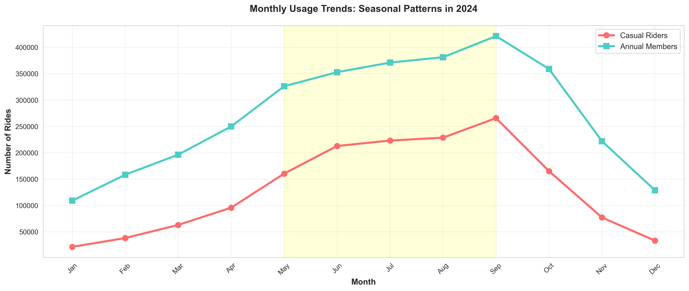

# Cyclistic Bike-Share Rider Analysis

End-to-end data analysis of 4.8M bike rides to uncover insights for converting casual riders into members | Google Data Analytics Capstone

---

## Table of Contents
1. [Project Overview](#project-overview)
2. [Business Problem](#business-problem)
3. [Tools & Technologies](#tools--technologies)
4. [Project Structure](#project-structure)
5. [Data Source](#data-source)
6. [Data Cleaning](#data-cleaning)
7. [Key Findings](#key-findings)
8. [Recommendations](#recommendations)
9. [Visualizations](#visualizations)
10. [SQL Queries](#sql-queries)
11. [How to Run](#how-to-run)
12. [Conclusion](#conclusion)

---

## Project Overview

Cyclistic is a bike-share company in Chicago operating over 5,800 bicycles across 692 stations. While the company attracts a large number of casual riders, its finance team has determined that annual members are significantly more profitable. This project analyzes rider behavior data from 2024 to identify key differences between casual riders and annual members, ultimately providing actionable marketing recommendations to drive membership conversions.

---

## Business Problem

**Primary Question:** How do annual members and casual riders use Cyclistic bikes differently?

**Supporting Questions:**
- Why would casual riders buy an annual membership?
- How can digital media influence casual riders to become members?

**Stakeholders:**
- Lily Moreno - Director of Marketing
- Cyclistic Marketing Analytics Team
- Cyclistic Executive Team

---

## Tools & Technologies

| Tool | Purpose |
|------|---------|
| Python (Pandas, NumPy) | Data cleaning, transformation, and analysis |
| Matplotlib, Seaborn | Data visualization and chart creation |
| MySQL | Data storage and analytical SQL queries |
| Jupyter Notebook | Interactive documentation and code execution |
| Anthropic Claude (AI Assistant) | Learning support and workflow guidance |

---

## Project Structure

```
Cyclistic-Bike-Share-Rider-Analysis/
│
├── notebooks/
│   ├── 01_data_preparation.ipynb      # ASK and PREPARE phases
│   ├── 02_data_cleaning.ipynb         # PROCESS phase - cleaning and transformation
│   ├── 03_exploratory_analysis.ipynb  # ANALYZE phase - member vs casual comparison
│   ├── 04_visualizations.ipynb        # SHARE phase - chart creation
│   ├── 05_mysql_integration.ipynb     # MySQL database setup and queries
│   ├── 06_key_findings.ipynb          # Key findings and recommendations
│   └── 07_project_summary.ipynb       # End-to-end project summary
│
├── sql/
│   └── queries.sql                    # 10 analytical SQL queries
│
├── visualizations/
│   ├── 01_member_distribution.png
│   ├── 02_duration_comparison.png
│   ├── 03_hourly_patterns.png
│   ├── 04_daily_patterns.png
│   ├── 05_monthly_trends.png
│   ├── 06_weekday_weekend_comparison.png
│   └── 07_bike_type_preferences.png
│
├── .gitignore
└── README.md
```

---

## Data Source

| Detail | Information |
|--------|-------------|
| Source | Divvy Bikes - City of Chicago |
| License | Public data by Motivate International Inc. |
| Period | January 2024 - December 2024 |
| Files | 12 monthly CSV files |
| Total Records | 5,860,568 |
| URL | https://divvy-tripdata.s3.amazonaws.com/index.html |

**Privacy Note:** The dataset contains no personally identifiable information (PII). Rider identity, credit card numbers, and home addresses are not included.

---

## Data Cleaning

### Issues Found and Fixed

| Issue | Records Affected | Action Taken |
|-------|-----------------|--------------|
| Duplicate ride IDs | 211 | Removed duplicates |
| Incorrect ride_length calculation | All records | Recalculated from timestamps |
| Negative ride duration | 227 | Removed invalid records |
| Zero duration rides | 496 | Removed invalid records |
| Rides exceeding 24 hours | 129,930 | Removed (likely lost/maintenance bikes) |

### Cleaning Summary

| Stage | Record Count |
|-------|-------------|
| Original combined data | 5,860,568 |
| After removing duplicates | 5,860,357 |
| After fixing and filtering ride_length | 4,859,019 |
| **Final clean dataset** | **4,859,019** |

- **Data retained:** 82.9%
- **Average ride duration:** 9.68 minutes
- **Median ride duration:** 8.52 minutes

---

## Key Findings

### Comprehensive Comparison

| Metric | Casual Riders | Annual Members |
|--------|--------------|----------------|
| Total Rides | 1,584,360 (32.6%) | 3,274,659 (67.4%) |
| Avg Ride Duration | 10.61 min | 9.23 min |
| Median Ride Duration | 9.60 min | 8.01 min |
| Peak Usage Day | Saturday | Wednesday |
| Peak Usage Hour | 5:00 PM | 5:00 PM |
| Weekday Rides | 65.1% | 76.7% |
| Weekend Rides | 34.9% | 23.3% |
| Summer Rides (May-Sep) | 68.8% | 56.6% |
| Winter Rides (Nov-Feb) | 10.7% | 18.9% |
| Most Used Bike | Electric Bike | Electric Bike |
| Electric Scooter Usage | 4.59% | 1.66% |

### Finding 1: Members Are Commuters, Casual Riders Are Leisure Users
Members exhibit clear commute patterns with two daily peaks at 7-8 AM and 4-6 PM on weekdays. Casual riders show only an afternoon/evening peak (4-6 PM), indicating recreational use rather than commuting.

### Finding 2: Weekend Usage Is the Biggest Differentiator
Members concentrate 76.7% of their rides on weekdays, while casual riders have a notably higher weekend usage at 34.9%. Casual riders also take longer rides on weekends (11.32 minutes average), further supporting leisure usage.

### Finding 3: Casual Rider Usage Is Highly Seasonal
68.8% of casual rides occur during summer months (May-September), compared to only 56.6% for members. Members maintain consistent usage year-round, indicating bike riding is a necessary part of their daily commute regardless of season.

### Finding 4: Casual Riders Take Longer But Less Frequent Trips
Casual riders average 10.61 minutes per ride versus 9.23 minutes for members. This longer duration combined with lower overall frequency suggests casual riders use bikes for leisure exploration rather than efficient point-to-point transportation.

### Finding 5: Both Groups Prefer Electric Bikes
Electric bikes account for 52-55% of rides for both groups. However, casual riders use electric scooters nearly three times more than members (4.59% vs 1.66%), suggesting casual riders prefer less physically demanding options.

---

## Recommendations

### Recommendation 1: Weekend-to-Weekday Conversion Campaign
**Target:** Casual riders who currently ride on weekends

**Strategy:**
- Launch a "Commute Challenge" encouraging casual riders to try biking to work
- Offer a free first-month membership trial
- Highlight time savings and environmental benefits of bike commuting
- Provide route planning tools showing bike paths to major business districts

**Rationale:** 34.9% of casual rides already happen on weekends, demonstrating regular engagement with the platform. Extending this habit to weekdays converts recreational users into daily commuters, the primary behavior pattern of annual members.

---

### Recommendation 2: Seasonal Membership Tier
**Target:** Casual riders who ride primarily during summer months

**Strategy:**
- Create a reduced-price "Summer Membership" covering May through September
- Include perks such as priority bike access, no unlock fees, and extended ride times
- Market heavily in April before peak season begins
- Position as a gateway to full annual membership

**Rationale:** 68.8% of casual rides occur May-September. Capturing these riders with a seasonal plan generates revenue during their active months while building familiarity with membership benefits, creating a natural pathway to full annual membership.

---

### Recommendation 3: In-App Targeted Notifications During Peak Hours
**Target:** Casual riders during their peak usage hours (4-6 PM)

**Strategy:**
- Send in-app notifications after casual rides showing potential monthly savings with membership
- Display real-time cost comparison between pay-per-ride and membership pricing
- Highlight member-exclusive benefits at point of ride completion
- Run targeted digital ads on social media during 4-6 PM window

**Rationale:** Casual riders already peak at 4-6 PM, meaning they are actively using the service. Delivering the membership value proposition at this moment maximizes relevance and increases the likelihood of conversion.

---

## Visualizations

All visualizations are saved in the `visualizations/` folder:





---

## SQL Queries

The `sql/queries.sql` file contains 10 analytical queries covering:

| Query | Business Question |
|-------|------------------|
| Query 1 | Total rides by member type |
| Query 2 | Average ride duration by member type |
| Query 3 | Most popular days for each member type |
| Query 4 | Peak hours for each member type |
| Query 5 | Monthly usage patterns |
| Query 6 | Bike type preferences |
| Query 7 | Weekday vs weekend comparison |
| Query 8 | Top 10 starting stations for casual riders |
| Query 9 | Top 10 starting stations for members |
| Query 10 | Overall usage summary statistics |

---

## How to Run

### Prerequisites
- Python 3.x
- MySQL Server
- Jupyter Notebook

### Install Python Dependencies
```bash
pip install pandas numpy matplotlib seaborn mysql-connector-python sqlalchemy pymysql jupyter
```

### Steps
1. Clone this repository
```bash
git clone https://github.com/mitadrudeb/Cyclistic-Bike-Share-Rider-Analysis.git
```

2. Download the 2024 monthly CSV files from [Divvy Trip Data](https://divvy-tripdata.s3.amazonaws.com/index.html) and place them in `data/raw/`

3. Open Jupyter Notebook and run notebooks in order:
```
01 → 02 → 03 → 04 → 05 → 06 → 07
```

4. For MySQL integration, update the connection credentials in `05_mysql_integration.ipynb` with your local MySQL credentials.

---

## Conclusion

This analysis clearly demonstrates that Cyclistic's casual riders and annual members have fundamentally different usage patterns. Members use bikes as a reliable commuting tool, riding consistently on weekdays throughout the year. Casual riders use bikes primarily for leisure, favoring weekends, summer months, and longer recreational trips.

The three recommendations target these specific behavioral differences: converting weekend riders into weekday commuters, capturing seasonal riders with a flexible membership tier, and leveraging peak usage hours to deliver targeted membership value propositions. Together, these strategies address the core challenge of making annual membership appealing to riders who currently see Cyclistic as a recreational service rather than an essential transportation tool.

---

*This project was completed as part of the Google Data Analytics Professional Certificate. AI assistants were leveraged during the learning process to support workflow guidance and problem-solving, while all data analysis, cleaning decisions, and business recommendations were independently developed and validated.*

*Analyst: MITADRU DEB*
*Date: 30/01/2026*
